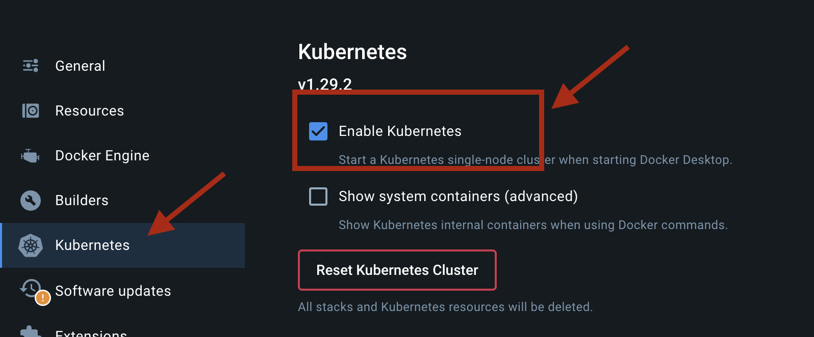

# Kubernetes II : Conceptos básicos

# Clúster K8s local
Para instalar un clúster de Kubernetes local podemos usar la misma aplicación Desktop de Docker:




```bash
	minikube start
```

```bash
	minikube start
```


## Espacio de nombres
En Kubernetes los objetos pueden pertenecer al clúster en si, o un espacio de nombre `namespace`.
Los Namespace son como un cluster virtual dentro de kubernetes, es deicr, es una forma de poder separar los objetos los unos de los otros.
----> NAMESPACE POR PROYECTO O ORGANIZACIÓN <-----

```bash Ver los namespaces 
	kubectl get namespaces
```

```bash Ver Pods de un namespace
	kubectl get pods -n name_of_namespane
```

```bash Crear namespace
	kubectl create namespace equip1
```

```bash Ver a que pertenece un objeto a namespace o cluster
```

```bash
	kubectl api-resources  
```


```bash
youneskabiri@Youness-MacBook-Pro ~ % kubectl get namespaces

NAME              STATUS   AGE
	default           Active   125d
	kube-node-lease   Active   125d
	kube-public       Active   125d
	kube-system       Active   125d
```


Los `namespaces` que encontramos nada mas instalar el clúster son:
* `default`: namespace predeterminado donde se colocan los recursos que no tienen un namespace especificado. Si no se especifica un namespace al crear un recurso, Kubernetes lo colocará automáticamente en el namespace "default".

* `kube-node-lease`: Este namespace se utiliza para alojar objetos de tipo **Lease** asociados a cada nodo del clúster. Los Leases son recursos utilizados por los componentes de Kubernetes para registrar y renovar la información de disponibilidad de los nodos en el clúster. Por ejemplo, los nodos pueden registrar su disponibilidad y condiciones utilizando Leases en este namespace.

* `kube-public`: Este namespace es accesible de forma global en el clúster y está reservado para recursos que deben ser accesibles a todos los usuarios y servicios en el clúster. Por lo general, se utilizan para almacenar recursos que proporcionan información general sobre el clúster, como el archivo de configuración kubeconfig y otros recursos compartidos.

* `kube-system`: Este namespace se utiliza para almacenar los recursos del sistema y los componentes internos de Kubernetes, como kube-dns, kube-proxy, kube-scheduler, etc. Estos recursos son esenciales para el funcionamiento del clúster y están separados del resto de las aplicaciones y recursos del usuario.


```bash
youneskabiri@Youness-MacBook-Pro ~ % kubectl get pods -n kube-system

	NAME                               READY   STATUS    RESTARTS        AGE
	coredns-5dd5756b68-lgj6z           1/1     Running   1 (125d ago)    125d
	etcd-minikube                      1/1     Running   1 (125d ago)    125d
	kube-apiserver-minikube            1/1     Running   1 (125d ago)    125d
	kube-controller-manager-minikube   1/1     Running   1 (125d ago)    125d
	kube-proxy-58zd6                   1/1     Running   1 (125d ago)    125d
	kube-scheduler-minikube            1/1     Running   1 (125d ago)    125d
	storage-provisioner                1/1     Running   2 (2m58s ago)   125d
```


Podemos crear un `namespace` por proyecto.

```bash
youneskabiri@Youness-MacBook-Pro ~ % kubectl create namespace equipo1
	namespace/equipo1 created

youneskabiri@Youness-MacBook-Pro ~ % kubectl get namespaces
	NAME              STATUS   AGE
	default           Active   125d
	equipo1           Active   4s
	kube-node-lease   Active   125d
	kube-public       Active   125d
	kube-system       Active   125d
	
```

```bash
	
```

## Forma declarativa vs imperativa:

## Comandos imperativos

### Configuración de objetos de forma imperativa: La forma imperativa es usando la CLI, es decir, interactundo con el clúster mediante comandos de la terminal.

```bash Ejemplo:
	kubectl create namespace equip1
```

### Configuración de objetos de forma declarativa: En cambio, con la forma declarativa es usando ficheros (.yaml).
```bash Ejemplo:
	kubectl apply -f nginx.yaml
```


## Objetos en Kubernetes

Los objetos en Kubernetes representan el estado actual del clúster a través del estado de los mismos y el deseado.

### Descipción de objetos: La descripción de objetos normalmente se hace mediante ficheros `.yaml`, pero también es posible con el formato `.json`.
**A la hora de dexribir un objeto son requeridos cuatro apartados**:

	- `apiVersion: versión k8s usada para crear dicho objeto.
	- `kind`: especificar tipo objeto (Pod, ns ...etc).
	- `metadata`: datos para identificar al objeto de forma única.
	- `spec`: especificaciones del objeto. El estado deseado para el mismo.


```yaml
apiVersion: apps/v1
kind: Deployment
metadata:
  name: nginx-deployment
spec:
  selector:
    matchLabels:
      app: nginx
  replicas: 2
  template:
    metadata:
      labels:
        app: nginx
    spec:
      containers:
        - name: nginx
          image: nginx:1.14.2
          ports:
            - containerPort: 80

```

```bash
	youneskabiri@Youness-MacBook-Pro files % kubectl apply -f object-deployment.yaml
		deployment.apps/nginx-deployment created
``


## Cuotas de recursos

## Etiquetas y anotaciones

## Authors

- [@Younes Kabiri Farah](https://github.com/younesKabiriFarah)


## Acknowledgements

 - [Kubernetes](https://kubernetes.io/docs/home/)
 - [Book: Kubernetes para profesionales: Desde cero al despliegue de aplicaciones seguras y resilientes](https://0xword.com/es/libros/213-kubernetes-para-profesionales-desde-cero-al-despliegue-de-aplicaciones-seguras-y-resilientes.html)


## Features

- Pods
- Exponiendo Pods
- Workloads
- Configuración de aplicaciones y secretos
- Selección de nodos
- Volúmenes Persistentes
- Autorización Basada en Roles
- Politicas de Red
- Contexto y Políticas de Seguridad


