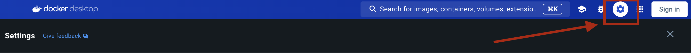

le# Kubernetes II : Conceptos básicos

# Clúster K8s local

Para instalar un clúster de Kubernetes local podemos usar la misma aplicación Desktop de Docker:




```bash
	minikube start
```

```bash
	minikube start
```


## Espacio de nombres

En Kubernetes los objetos pueden pertenecer al clúster en si, o un espacio de nombre `namespace`.
Los Namespace son como un cluster virtual dentro de kubernetes, es deicr, es una forma de poder separar los objetos los unos de los otros.
----> NAMESPACE POR PROYECTO O ORGANIZACIÓN <-----

```bash Ver los namespaces 
	kubectl get namespaces
```

```bash Ver Pods de un namespace
	kubectl get pods -n name_of_namespane
```

```bash Crear namespace
	kubectl create namespace equip1
```

```bash Ver a que pertenece un objeto a namespace o cluster
    kubectl api-resources
```


```bash
youneskabiri@Youness-MacBook-Pro ~ % kubectl get namespaces

NAME              STATUS   AGE
	default           Active   125d
	kube-node-lease   Active   125d
	kube-public       Active   125d
	kube-system       Active   125d
```


Los `namespaces` que encontramos nada mas instalar el clúster son:
* `default`: namespace predeterminado donde se colocan los recursos que no tienen un namespace especificado. Si no se especifica un namespace al crear un recurso, Kubernetes lo colocará automáticamente en el namespace "default".

* `kube-node-lease`: Este namespace se utiliza para alojar objetos de tipo **Lease** asociados a cada nodo del clúster. Los Leases son recursos utilizados por los componentes de Kubernetes para registrar y renovar la información de disponibilidad de los nodos en el clúster. Por ejemplo, los nodos pueden registrar su disponibilidad y condiciones utilizando Leases en este namespace.

* `kube-public`: Este namespace es accesible de forma global en el clúster y está reservado para recursos que deben ser accesibles a todos los usuarios y servicios en el clúster. Por lo general, se utilizan para almacenar recursos que proporcionan información general sobre el clúster, como el archivo de configuración kubeconfig y otros recursos compartidos.

* `kube-system`: Este namespace se utiliza para almacenar los recursos del sistema y los componentes internos de Kubernetes, como kube-dns, kube-proxy, kube-scheduler, etc. Estos recursos son esenciales para el funcionamiento del clúster y están separados del resto de las aplicaciones y recursos del usuario.


```bash
youneskabiri@Youness-MacBook-Pro ~ % kubectl get pods -n kube-system

	NAME                               READY   STATUS    RESTARTS        AGE
	coredns-5dd5756b68-lgj6z           1/1     Running   1 (125d ago)    125d
	etcd-minikube                      1/1     Running   1 (125d ago)    125d
	kube-apiserver-minikube            1/1     Running   1 (125d ago)    125d
	kube-controller-manager-minikube   1/1     Running   1 (125d ago)    125d
	kube-proxy-58zd6                   1/1     Running   1 (125d ago)    125d
	kube-scheduler-minikube            1/1     Running   1 (125d ago)    125d
	storage-provisioner                1/1     Running   2 (2m58s ago)   125d
```


Podemos crear un `namespace` por proyecto.

```bash
youneskabiri@Youness-MacBook-Pro ~ % kubectl create namespace equipo1
	namespace/equipo1 created

youneskabiri@Youness-MacBook-Pro ~ % kubectl get namespaces
	NAME              STATUS   AGE
	default           Active   125d
	equipo1           Active   4s
	kube-node-lease   Active   125d
	kube-public       Active   125d
	kube-system       Active   125d
	
```

```bash
	
```

## Forma declarativa vs imperativa:

## Comandos imperativos

### Configuración de objetos de forma imperativa: La forma imperativa es usando la CLI, es decir, interactundo con el clúster mediante comandos de la terminal.

**Ejemplo**
```bash
	kubectl create namespace equip1
```

### Configuración de objetos de forma declarativa: En cambio, con la forma declarativa es usando ficheros (.yaml).
```bash Ejemplo:
	kubectl apply -f nginx.yaml
```


## Objetos en Kubernetes

Los objetos en Kubernetes representan el estado actual del clúster a través del estado de los mismos y el deseado.

### Descipción de objetos: La descripción de objetos normalmente se hace mediante ficheros `.yaml`, pero también es posible con el formato `.json`.
**A la hora de dexribir un objeto son requeridos cuatro apartados**:

	- `apiVersion: versión k8s usada para crear dicho objeto.
	- `kind`: especificar tipo objeto (Pod, ns ...etc).
	- `metadata`: datos para identificar al objeto de forma única.
	- `spec`: especificaciones del objeto. El estado deseado para el mismo.


```yaml
apiVersion: apps/v1
kind: Deployment
metadata:
  name: nginx-deployment
spec:
  selector:
    matchLabels:
      app: nginx
  replicas: 2
  template:
    metadata:
      labels:
        app: nginx
    spec:
      containers:
        - name: nginx
          image: nginx:1.14.2
          ports:
            - containerPort: 80

```

```bash
	youneskabiri@Youness-MacBook-Pro files % kubectl apply -f object-deployment.yaml
		deployment.apps/nginx-deployment created
```
Una forma más legible para el ser humano a la hora de ver obtener información es con el flag **-o** que puede ser `.yaml` o `.json`.

```bash
    kubectl get deploment redis -o yaml
```

**Importante :** Si queremos hacer una simulación de la creación de un objeto en el clúster si efectuar dicha creación, usamos `dry-run=client`, de esta forma solo se simulará en cliente sin enviar los datos al servidor.

```bash
    kubectl run nginxpod --image nginx --dry-run=client
```    

    ----> [FLAG] --dry-run=client : No enviar cambios al clúster.
	----> [FLAG] --dry-run=server : Se envia al cluster PERO NO se procesa = No cambiar estado.


## Cuotas de recursos

Las quotas son mecanismos de control que permiten limitar los recursos consumidos por los Pods y los objetos de Kubernetes en un namespace específico.
	
	- `Computación`: Limita recursos de computo de un namespace.
	- `Almacenamiento`: Limita recursos de almacenamiento dentro de un cluster.
	- `Contador de objeto`: Limita el número de objetos que se pueden crear dentro de namespace.

```bash
    kubectl create ns cuotas
```	

```yaml
apiVersion: v1
kind: ResourceQuota
metadata:
  name: miquota
  namespace: cuotas
spec:
  hard:
    count/pods: "1"
    count/secrets: "1"
    limits.memory: 1Gi
```

```bash
    kubectl apply -f ns cuotas.yaml
```		

```bash
    youneskabiri@Youness-MacBook-Pro files % kubectl create ns cuotas   
        namespace/cuotas created
    youneskabiri@Youness-MacBook-Pro files % kubectl apply -f quota.yaml
        resourcequota/miquota created
```

**Obtener quota**
```bash 
    kubectl get quota -n cuotas	
```

**Crear Pod nginx en namespace cuota**
```bash 
    ubectl run pod1 --image nginx -n cuotas 
```

**Ver INFO de cuota**
```bash 
    kubectl describe quota -n cuotas
```

## Etiquetas y anotaciones


Las etiquetas (labels) y las anotaciones (annotations) son dos formas de adjuntar metadatos a los recursos dentro del clúster, pero tienen propósitos y características ligeramente diferentes:

    - **Etiqueta (Label)** :
      - Las etiquetas son pares clave-valor asociados a los recursos de Kubernetes.
      - Se utilizan principalmente para identificar y organizar los recursos.
      - Las etiquetas pueden ser usadas para seleccionar y filtrar recursos en consultas y búsquedas.
      - Las etiquetas son flexibles y pueden ser cambiadas durante el ciclo de vida del recurso.
 
        Ejemplo de uso: agrupar pods que pertenecen a una misma aplicación o entorno de desarrollo.**
  

    - **Anotación (Annotations)** :
        - Las anotaciones también son pares clave-valor asociados a los recursos de Kubernetes.
        - Se utilizan para adjuntar metadatos adicionales que `NO son utilizados para identificar o seleccionar los recursos`.
        - Las anotaciones pueden contener información como **timestamps, versiones, herramientas de seguimiento, políticas de respaldo, etc**.
        - A diferencia de las etiquetas, **las anotaciones no son utilizadas directamente por Kubernetes** para la gestión de recursos, sino que pueden ser utilizadas por herramientas de terceros o scripts personalizados.
    
        Ejemplo de uso: almacenar información de auditoría, información de configuración específica de la aplicación, etc.

```yaml
apiVersion: v1
kind: Pod
metadata:
  name: example-label
  app: nginx
spec:
  container:
  - name: nginx
    image: nginx
```

En este ejemplo se muestra la definición de un Pod con las etiquetas entorno y app.

**Ver contenedores con sus labels**
```bash 
    kubectl get po --show-labels
```

**Añadir nueva etiqueta a un Pod llamado `nginxpod`**
```bash 
    kubectl label pod nginxpod version=1.0
```

**Modificar un label**
```bash 
    kubectl label pod nginxpod version=2.0 --overwrite
```


## Authors

- [@Younes Kabiri Farah](https://github.com/younesKabiriFarah)


## Acknowledgements

 - [Kubernetes](https://kubernetes.io/docs/home/)
 - [Book: Kubernetes para profesionales: Desde cero al despliegue de aplicaciones seguras y resilientes](https://0xword.com/es/libros/213-kubernetes-para-profesionales-desde-cero-al-despliegue-de-aplicaciones-seguras-y-resilientes.html)


## Features

- Pods
- Exponiendo Pods
- Workloads
- Configuración de aplicaciones y secretos
- Selección de nodos
- Volúmenes Persistentes
- Autorización Basada en Roles
- Politicas de Red
- Contexto y Políticas de Seguridad
